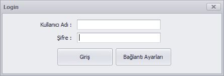
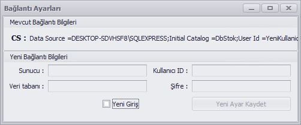
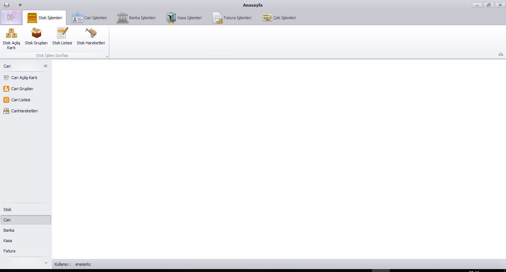
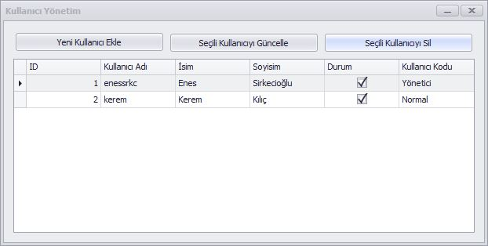
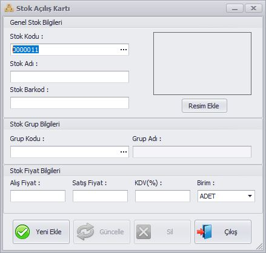
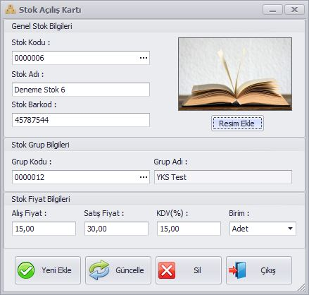
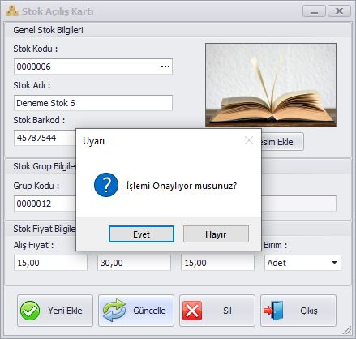
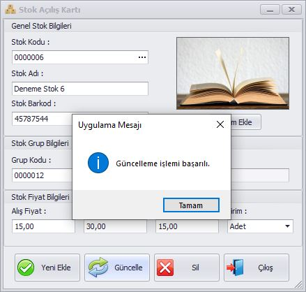
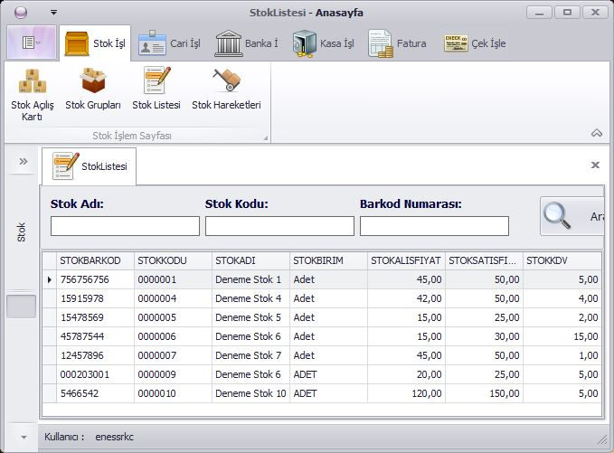

# Muhasebe Otomasyonu
> * _Microsoft Visual Studio Communtiy 2019
 Sürüm 16.1.1_ ortamında, MsSql 18, DevExpress 19.1 eklentisi ve
 C# kullanılarak yapılmıştır.
> * Uygulamanın her aşaması 'commit' edilmiştir.
> * Bitirme Tarihi: 13.10.2019
> * Yazar: Enes Sirkecioğlu
> * Mail: enes.sirkecoglu@ogr.sakarya.edu.tr

## Uygulamanın Kullanımı ve Ekran Görüntüleri

#### Giriş Sayfası
 
* Uygulama ilk çalıştırıldığında giriş ekranı sayfası gelmektedir.
* Giriş yapmadan önce bağlantı ayarlarından bağlanılacak veritabanı seçilebilir.
 
* Yeni giriş kutusu seçilmeden giriş işlemi yapılmamaktadır.
 
* Uygulamaya giriş yapıldığında yukarıdaki görseldeki gibi ekran açılacaktır.
* Uygulamanın sol üst köşesinde bulunan butona basınca kullanıcı yönetim paneli açılmaktadır.
* Listeleme işlemi 'gridControl' aracı ve Linq kodları kullanılarak yapılmaktadır.
 
 * Yukarıdaki yönetim panelinde kullanıcı ekleme, silme ve güncelleme işlemleri yapılmaktadır.

#### Stok İşlemleri
###### Stok Kartı
* Stok Kartı formu herhangi bir stok eklemek veya güncellemek için kullanılır.

* Stok Kodu alanının butonundan bir stok seçilirse güncelleme ve silme işlemleri aktif hale gelmektedir.
* Grup Kodu alanının butonundan grup seçilerek stoğun grubu değiştirilebilir.

* Herhangi bir işlem yapılmadan önce onay mesajı gösterilmektedir. Bu onay sorusunun cevabına göre işlemler devam etmektedir.

* İşlemler başarılı olursa veya hata alınırsa bunların da mesajları gösterilmektedir.

###### Stok Listesi
* Stok Listesi seçildiğinde anasayfa üzerinde pencere olarak açılmaktadır. Eğer başka
bir formdan çağrılırsa ayrı bir pencere olarak açılmaktadır.

###### Stok Grupları
* Bu formda stok grupları listelenmektedir.
* Listeden herhangi bir veriye çift tıklanarak seçilirse güncelleme ve silme işlemi aktif olacaktır.
* Aramak istenen grup bilgileri girilerek arama yapılabilir. (Arama sorgusu linq komutları ile yapılmaktadır.)
* Uygulamada listelemeler için gridControl araçları kullanılmıştır.

 

